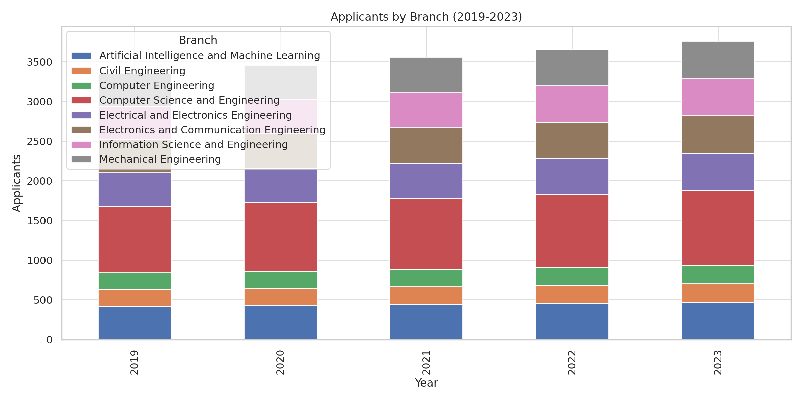
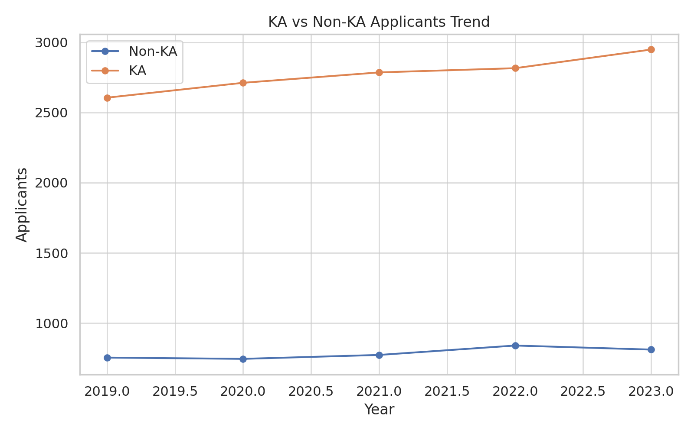
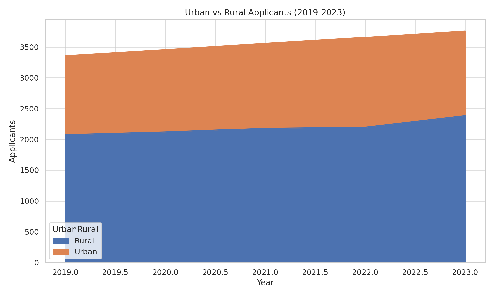
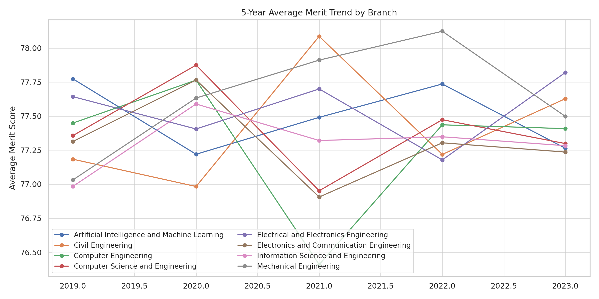
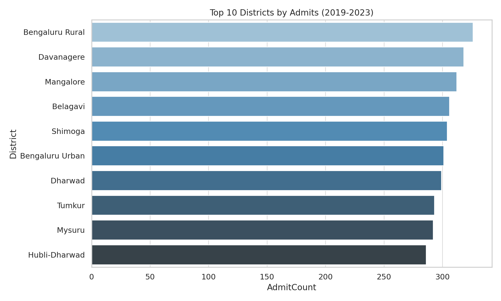
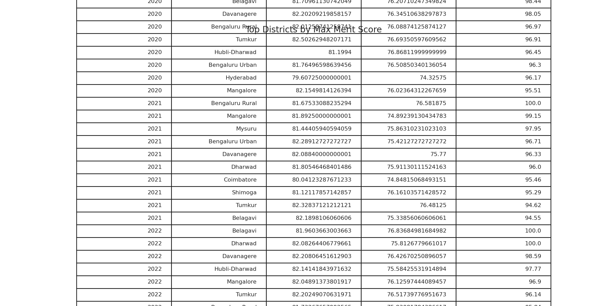

## 🎓 Admissions Analytics (KCET-style Simulation)

This repository contains a **near-realistic admissions analytics project** for **College  Bangalore**.  
It simulates **KCET-style seat allocation and applicant data** across **2019–2023**, using **Python (data generation), SQL (queries), Excel/Power BI (dashboards)**.

---

## 📊 Key Features
- **State-wise Analysis**: Karnataka vs Non-KA applicants  
- **Urban–Rural Distribution** over 5 years  
- **District-wise seat distribution** and merit trends  
- **Quota Utilization**: Government vs Management, Merit vs Self-Financed  
- **5-Year Merit Trend Analysis** across branches  
- **Drill-down dashboards** for admissions insights  

---
---

## 📈 Dashboards (Power BI-style)

### Applicants by Branch (2019–2023)

### Karnataka vs Non-KA Applicants

### Urban vs Rural Applicants

### 5-Year Merit Trend by Branch

### Top 10 Districts by Admits

### Max Aggregate by Year & District

---

## 🛠️ Tech Stack
- **Python (pandas, numpy, seaborn, matplotlib)** → Data simulation + exports  
- **SQL** → Schema + queries for validation  
- **Excel/Power BI** → Visualization & dashboards  

---

## 📌 Impact

Created realistic admissions analytics system for engineering colleges.

Enables college leadership to make data-driven decisions.

Useful for curriculum planning, outreach strategies, and policy-making.

